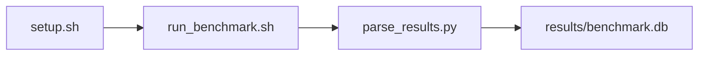

# Linux perf PMU Analysis Harness Benchmark

[](LICENSE)
[](https://github.com/garys-gpu-benchmarks/111-sys-bench-amd-linux-perf-pmu-ubu2404/actions/workflows/ci.yml)

Target: Ubuntu 24.04 · AMD · see Hardware Requirements. This is a host benchmark, not a laptop `pip install` project.

## Quick Start

```bash
git clone https://github.com/garys-gpu-benchmarks/111-sys-bench-amd-linux-perf-pmu-ubu2404.git
cd 111-sys-bench-amd-linux-perf-pmu-ubu2404
sudo bash setup.sh --assume-yes
bash run_benchmark.sh --profile smoke --validate
```
Results are written to `results/benchmark.db` and `results/summary.json`.

This workload is executed on the validation host after the repository is copied there. `setup.sh` and `run_benchmark.sh` do not open an outbound SSH session.

Prerequisites: Ubuntu 24.04; AMD; Python 3.12.3; root or sudo for `setup.sh`. Framework: Bash, SQLite, Python, PyYAML, Linux PMU, stress-ng. This is a host benchmark, not a laptop `pip install` project.



## 1. Overview

Runs each yaml workload_commands entry under perf stat -x, and derives IPC, branch-mispredict percent, cache misses per 1,000 instructions, stall percent, and context switches/s. num_cpus substitutes into stress-ng. event_list adds perf events; unknown names are dropped. duration is seconds per command. Sweep dimensions: num_cpus, workload_commands, event_list, duration, output_format.

## 2. What It Validates

- Validates that each yaml stress-ng command completes under perf stat and that IPC, branch misprediction, cache-miss, pipeline-stall, and context-switch rates are parsed, or reported as na (<reason>) when the host does not expose a PMU counter
- #1: Instructions per cycle (instructions_per_cycle_ipc); is present and physically sensible.
- #2: Branch misprediction rate, pct (branch_misprediction_rate); is present and physically sensible.
- #3: Cache misses per 1,000 instructions (cache_misses_per_1000_instructions); is present and physically sensible.
- #4: Pipeline stalls, pct (pipeline_stall_pct); is present and physically sensible.
- #5: Ctx switches/s (context_switches_during_workload_switches_s) is present and physically sensible.

## 3. Metrics Captured

- **#1: Instructions per cycle** — stored as `instructions_per_cycle_ipc`.
- **#2: Branch misprediction rate, pct** — stored as `branch_misprediction_rate`.
- **#3: Cache misses per 1,000 instructions** — stored as `cache_misses_per_1000_instructions`.
- **#4: Pipeline stalls, pct** — stored as `pipeline_stall_pct`.
- **#5: Ctx switches/s** — stored as `context_switches_during_workload_switches_s`.

## 4. Hardware Requirements

### Supported environment

- OS: Ubuntu 24.04
- GPU vendor: AMD
- Framework family: Bash, SQLite, Python, PyYAML, Linux PMU, stress-ng
- Python: Python 3.12.3

### Reference validation environment

The tables below describe the machine used to generate the reference results. They are not a requirement that every user buy that exact cloud instance.

### System

Ubuntu 24.04 / AMD / Bash, SQLite, Python, PyYAML, Linux PMU, stress-ng

### GPU

Ubuntu 24.04 / AMD / Bash, SQLite, Python, PyYAML, Linux PMU, stress-ng

## 5. Software Requirements

| Component | Version |
|---|---|
| OS | Ubuntu 24.04 |
| Kernel | kernel 6.8.0 |
| Python | Python 3.12.3 |
| ROCm | N/A - ROCm not used |
| rocBLAS | N/A - rocBLAS not used |

Runs each yaml workload_commands entry under perf stat -x, and derives IPC, branch-mispredict percent, cache misses per 1,000 instructions, stall percent, and context switches/s. num_cpus substitutes into stress-ng. event_list adds perf events; unknown names are dropped.

## 6. Installation

```bash
Run apt installed Linux perf (linux-tools-$(uname -r)) as perf stat -x, -e <events> -- <stress-ng command> for each yaml workload command. stress-ng is the workload generator
```

## 7. Running the Benchmark

```bash
Run apt installed Linux perf (linux-tools-$(uname -r)) as perf stat -x, -e <events> -- <stress-ng command> for each yaml workload command. stress-ng is the workload generator
```

**Validating results separately:**

```bash
export BENCHMARK_PYTHON=/usr/bin/python3.13  # optional
python3 -m venv .venv
source ".venv/bin/activate"
".venv/bin/python" scripts/validate_results.py
```

## 8. Output

### `results/benchmark.db` (SQLite)

CSV, one row per workload command (duplicated when only one command), plus perf_N.csv, perf_N.txt, and pmu_events.txt

sample_index,status,workload_command,duration_sec,elapsed_sec,instructions_per_cycle_ipc,branch_misprediction_rate,cache_misses_per_1000_instructions,pipeline_stall_pct,context_switches_during_workload_switches_s,cycles,instructions,branches,branch_misses,cache_misses,stall_cycles,pipeline_stall_event,pmu_counter_running_pct,context_switches,cpu_time_sec,cpu_utilization_percent,stress_ng_bogo_ops_s,pmu_source,error_message
0,ok,stress-ng,5,5.1,1.2,2.0,8.0,15,100,1e9,1.2e9,1e8,2e6,1e7,1.5e8,stalled-cycles-backend,100,500,4.8,96,1000,perf,

```bash
Run apt installed Linux perf (linux-tools-$(uname -r)) as perf stat -x, -e <events> -- <stress-ng command> for each yaml workload command. stress-ng is the workload generator
```

### `results/summary.json`

Consolidated metrics from the most recent run — suitable for CI artifact upload or dashboard ingestion.

### `results/raw/<timestamp>.txt`

CSV, one row per workload command (duplicated when only one command), plus perf_N.csv, perf_N.txt, and pmu_events.txt

sample_index,status,workload_command,duration_sec,elapsed_sec,instructions_per_cycle_ipc,branch_misprediction_rate,cache_misses_per_1000_instructions,pipeline_stall_pct,context_switches_during_workload_switches_s,cycles,instructions,branches,branch_misses,cache_misses,stall_cycles,pipeline_stall_event,pmu_counter_running_pct,context_switches,cpu_time_sec,cpu_utilization_percent,stress_ng_bogo_ops_s,pmu_source,error_message
0,ok,stress-ng,5,5.1,1.2,2.0,8.0,15,100,1e9,1.2e9,1e8,2e6,1e7,1.5e8,stalled-cycles-backend,100,500,4.8,96,1000,perf,

## 9. Baselines / Thresholds

Expected ranges and gates live in `config/benchmark_config.yaml` under `baselines:` or `thresholds:`. To update them, edit that file — never edit validation code directly.

## 10. Troubleshooting

**`setup.sh` missing collector**
Create cannot finish without `scripts/collect_workload.py`.

**`self_check` overlay rewritten**
Do not overwrite files listed in `results/overlay_lock.json`.

**Remote SSH drop during setup**
Reconnect and resume `bash setup.sh --assume-yes`. Do not wipe `.venv` or `.cache`.

## 11. NVIDIA H100 Coding Differences

Primary target is AMD ROCm. NVIDIA notes in this section are reference only and are not the execution path.

## Repository layout

```text
.
├── setup.sh
├── run_benchmark.sh
├── benchmark_specification.json
├── .github/workflows/      # thin CI callers (see Continuous Integration)
├── config/
├── scripts/
├── src/
├── tests/
├── docs/
├── results/
└── LICENSE
```

## Continuous Integration

| Workflow | Runs on | When | What it does |
|---|---|---|---|
| [CI](.github/workflows/ci.yml) | GitHub-hosted runner | every pull request, and every push to `main` | shellcheck, ruff, `bash -n`, `compileall`, `run_benchmark.sh --help`, specification schema, the results validator on a seeded fixture, required files, and actionlint. No GPU and no benchmark run. |
| [GPU Smoke Benchmark](.github/workflows/gpu-smoke.yml) | self-hosted runner labeled `gpu`, `amd`, `ubu2404` | only when started by hand: **Actions → GPU Smoke Benchmark → Run workflow** (choose `smoke`, `baseline` or `extended`) | Verifies the pre-provisioned GPU stack, records `results/environment.json` (driver, runtime, kernel, GPU), runs the profile with `--validate`, shows headline metrics on the run page, and uploads the results. |

Both files are short callers. The steps themselves live once, for every workload in the suite, in [`garys-gpu-benchmarks/shared-workflows`](https://github.com/garys-gpu-benchmarks/shared-workflows), pinned at `@v1`. The GPU workflow is never triggered by pull requests, so code from a fork cannot run on the GPU host.

### Running it as part of the AMD Ubuntu 24.04 bundle

This repository is one of the 32 workloads in [`bundle-amd-ubuntu-2404`](https://github.com/garys-gpu-benchmarks/bundle-amd-ubuntu-2404), which holds them as git submodules. To put the whole bundle on a GPU host and run this workload from it:

```bash
git clone --recurse-submodules https://github.com/garys-gpu-benchmarks/bundle-amd-ubuntu-2404 /opt/benchmarks
cd /opt/benchmarks/111-sys-bench-amd-linux-perf-pmu-ubu2404
bash run_benchmark.sh --profile smoke --validate
```
